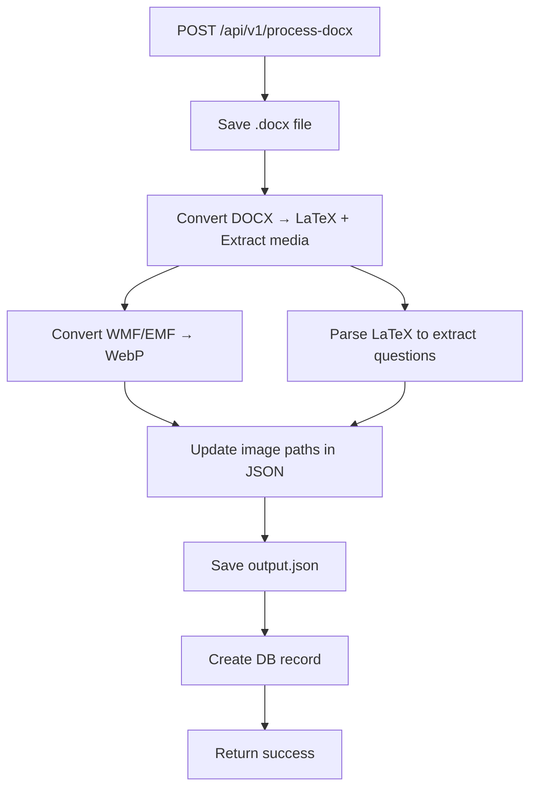
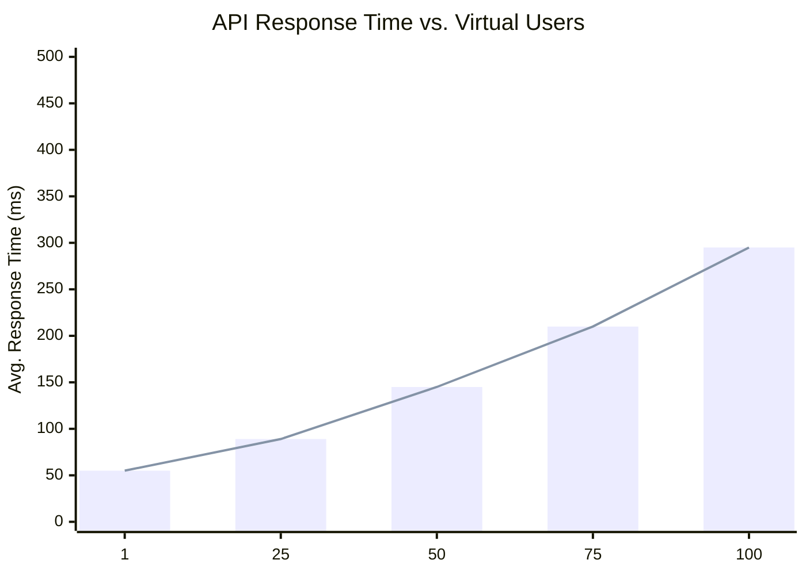
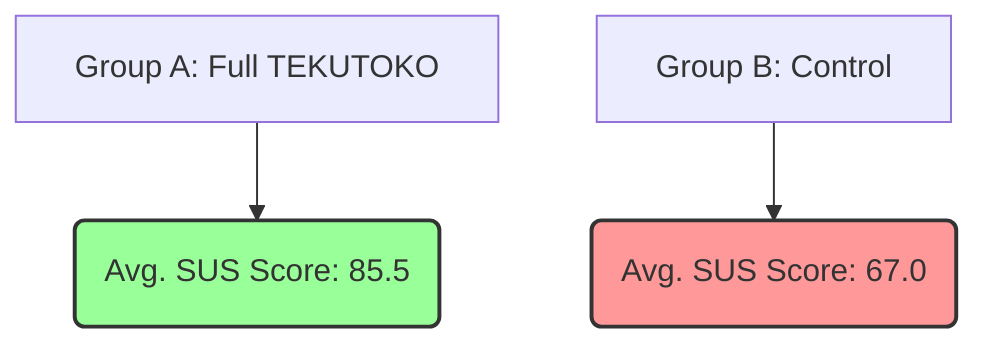
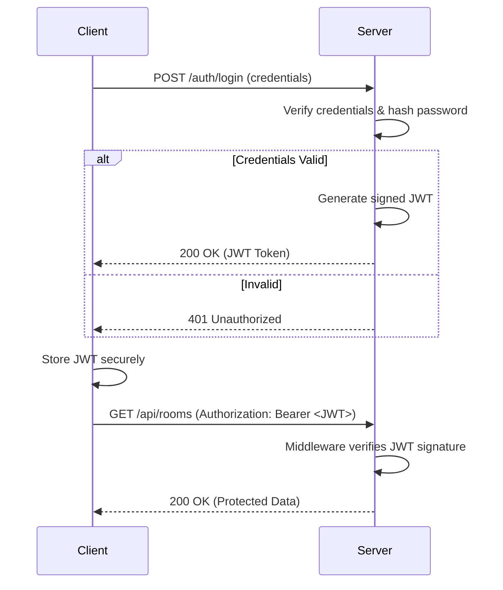
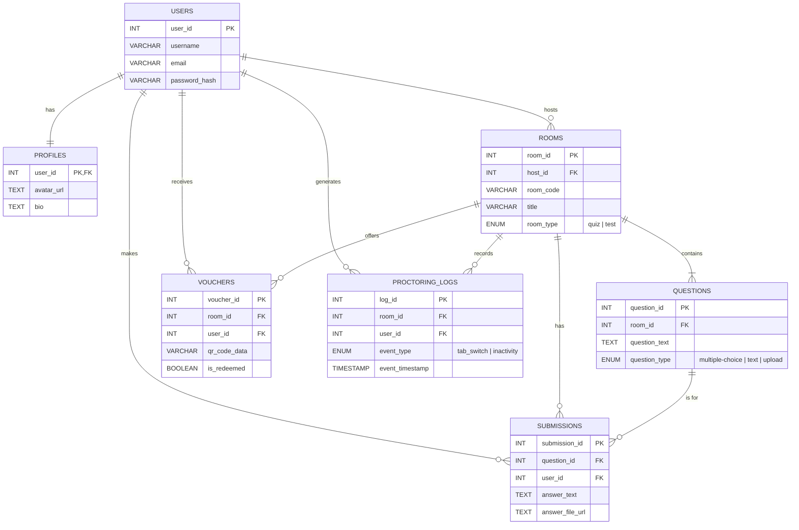
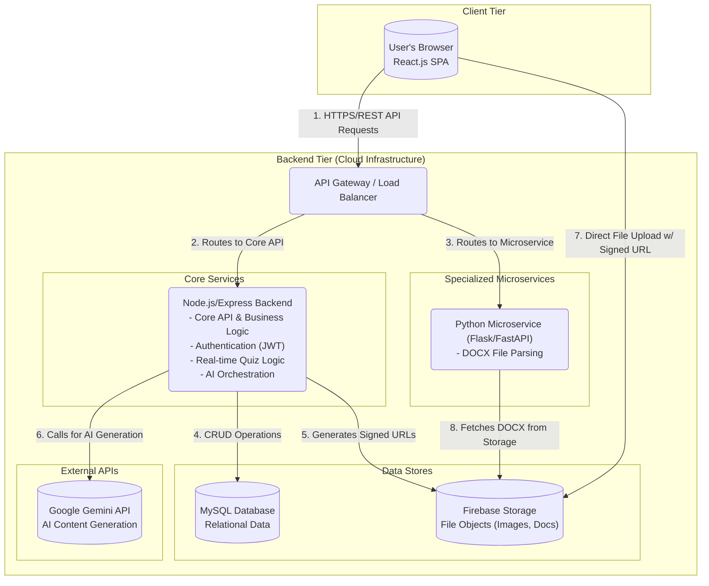
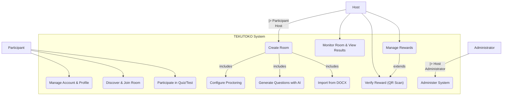

python-microservice-flow.png

```mermaid
graph TD
    A["POST /api/v1/process-docx"]
    A --> B["Save .docx file"]
    B --> C["Convert DOCX → LaTeX + Extract media"]

    %% nhánh song song ngang
    C --> D1["Convert WMF/EMF → WebP"]
    C --> D2["Parse LaTeX to extract questions"]

    D1 --> E["Update image paths in JSON"]
    D2 --> E
    E --> F["Save output.json"]
    F --> G["Create DB record"]
    G --> H["Return success"]
```

load-test-results.png

```mermaid
xychart-beta
    title "API Response Time vs. Virtual Users"
    x-axis [1, 25, 50, 75, 100]
    y-axis "Avg. Response Time (ms)" 0 --> 500
    bar [55, 89, 145, 210, 295]
    line [55, 89, 145, 210, 295]
```

sus-comparison.png

```mermaid
graph TD
    A[Group A: Full TEKUTOKO] --> B(Avg. SUS Score: 85.5);
    C[Group B: Control] --> D(Avg. SUS Score: 67.0);
    style B fill:#9f9,stroke:#333,stroke-width:2px
    style D fill:#f99,stroke:#333,stroke-width:2px
```

jwt-flow.png

```mermaid
sequenceDiagram
    participant Client
    participant Server
    Client->>Server: POST /auth/login (credentials)
    Server->>Server: Verify credentials & hash password
    alt Credentials Valid
        Server->>Server: Generate signed JWT
        Server-->>Client: 200 OK (JWT Token)
    else Invalid
        Server-->>Client: 401 Unauthorized
    end
    Client->>Client: Store JWT securely
    Client->>Server: GET /api/rooms (Authorization: Bearer <JWT>)
    Server->>Server: Middleware verifies JWT signature
    Server-->>Client: 200 OK (Protected Data)
```

erd-diagram.png

```mermaid
erDiagram
    USERS {
        INT user_id PK
        VARCHAR username
        VARCHAR email
        VARCHAR password_hash
    }
    PROFILES {
        INT user_id PK, FK
        TEXT avatar_url
        TEXT bio
    }
    ROOMS {
        INT room_id PK
        INT host_id FK
        VARCHAR room_code
        VARCHAR title
        ENUM room_type "quiz | test"
    }
    QUESTIONS {
        INT question_id PK
        INT room_id FK
        TEXT question_text
        ENUM question_type "multiple-choice | text | upload"
    }
    SUBMISSIONS {
        INT submission_id PK
        INT question_id FK
        INT user_id FK
        TEXT answer_text
        TEXT answer_file_url
    }
    VOUCHERS {
        INT voucher_id PK
        INT room_id FK
        INT user_id FK
        VARCHAR qr_code_data
        BOOLEAN is_redeemed
    }
    PROCTORING_LOGS {
        INT log_id PK
        INT room_id FK
        INT user_id FK
        ENUM event_type "tab_switch | inactivity"
        TIMESTAMP event_timestamp
    }

    USERS ||--|| PROFILES : "has"
    USERS ||--o{ ROOMS : "hosts"
    USERS ||--o{ SUBMISSIONS : "makes"
    USERS ||--o{ VOUCHERS : "receives"
    USERS ||--o{ PROCTORING_LOGS : "generates"
    ROOMS ||--|{ QUESTIONS : "contains"
    ROOMS ||--o{ SUBMISSIONS : "has"
    ROOMS ||--o{ VOUCHERS : "offers"
    ROOMS ||--o{ PROCTORING_LOGS : "records"
    QUESTIONS ||--o{ SUBMISSIONS : "is for"
```

system-architecture.png

```mermaid
graph TD
    subgraph "Client Tier"
        UserBrowser[("User's Browser<br>React.js SPA")]
    end
    subgraph "Backend Tier (Cloud Infrastructure)"
        APIGateway("API Gateway / Load Balancer")
        subgraph "Core Services"
            NodeBackend("Node.js/Express Backend<br>- Core API & Business Logic<br>- Authentication (JWT)<br>- Real-time Quiz Logic<br>- AI Orchestration")
        end
        subgraph "Specialized Microservices"
            PythonService("Python Microservice (Flask/FastAPI)<br>- DOCX File Parsing")
        end
        subgraph "Data Stores"
            MySQL_DB[("MySQL Database<br>Relational Data")]
            FirebaseStore[("Firebase Storage<br>File Objects (Images, Docs)")]
        end
        subgraph "External APIs"
            GeminiAPI[("Google Gemini API<br>AI Content Generation")]
        end
    end
    UserBrowser -- "1. HTTPS/REST API Requests" --> APIGateway
    APIGateway -- "2. Routes to Core API" --> NodeBackend
    APIGateway -- "3. Routes to Microservice" --> PythonService
    NodeBackend -- "4. CRUD Operations" --> MySQL_DB
    NodeBackend -- "5. Generates Signed URLs" --> FirebaseStore
    NodeBackend -- "6. Calls for AI Generation" --> GeminiAPI
    PythonService -- "8. Fetches DOCX from Storage" --> FirebaseStore
    UserBrowser -- "7. Direct File Upload w/ Signed URL" --> FirebaseStore
```

use-case-diagram.png

```mermaid
graph TD
    subgraph "TEKUTOKO System"
        UC1("Manage Account & Profile")
        UC2("Discover & Join Room")
        UC3("Participate in Quiz/Test")
        UC4("Create Room")
        UC5("Configure Proctoring")
        UC6("Generate Questions with AI")
        UC7("Import from DOCX")
        UC8("Monitor Room & View Results")
        UC9("Manage Rewards")
        UC10("Verify Reward (QR Scan)")
        UC11("Administer System")
    end

    Participant --> UC1
    Participant --> UC2
    Participant --> UC3

    Host --|> Participant
    Host --> UC4
    Host --> UC8
    Host --> UC9
    Host --> UC10

    Administrator --|> Host
    Administrator --> UC11

    UC4 -- includes --> UC6
    UC4 -- includes --> UC7
    UC4 -- includes --> UC5
    UC9 -- extends --> UC10
```